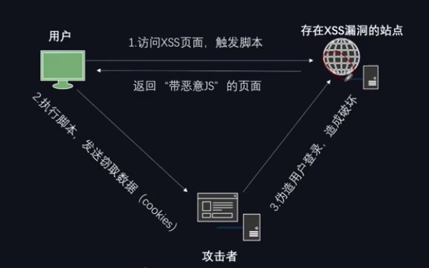
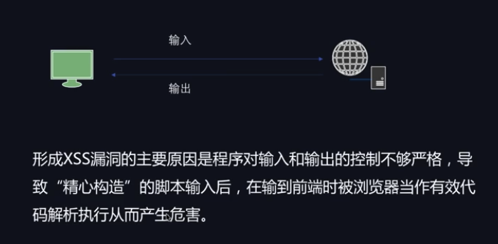

# XSS

## XSS原理

- 反射型：交互的数据一般不会被存在数据库里面，一次性，所见即所得，一般出现在查询类页面等
- 存储型：交互的数据会被存储在数据库里面，永久性存储，一般出现在留言板，注册等页面
- DOM型：不与后台服务器产生数据交互，是一种通过DOM操作前端代码输出的时候产生的问题，一次性也属于反射型

## XSS测试流程
- 1.在目标站点上找到输入点，比如查询接口，留言板等
- 2.输入一组“特殊字符+唯一识别字符”，点击提交后，查看返回的源码，是否有做对应的处理
- 3.通过搜索定位到唯一字符，结合唯一字符前后语法确认是否可以构造执行js的条件(构造闭合)
- 4.提交构造的脚本代码(以及各种绕过姿势)，看是否可以成功执行，如果成功执行则说明存在XSS漏洞

TIPS：
- 1.一般查询接口容易出现反射型XSS，留言板容易出现存储型XSS
- 2.由于后台可能存在过滤措施，构造的script可能会被过滤掉，而无法生效，或者环境限制了执行(浏览器)
- 3.通过变化不同的script，尝试绕过后台过滤机制