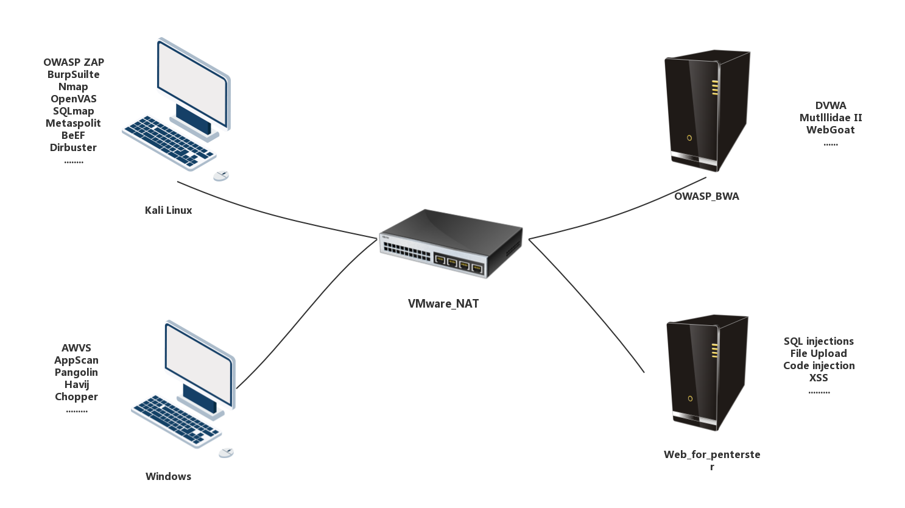

# 渗透实验室搭建

## 1.实验室拓扑
<br>

## 2.网络说明
采用VMware/VirtualBOX等虚拟机搭建，采用nat或host-only模式，保证所有机器在同一网段互联互通<br>

## 3.渗透机说明
### 1.kali
#### 1.基本优化
移除打印机、声卡等硬件，内存给1G到2G即可。<br>
#### 2.安装vm-tools
kali中vm-tools安装方法：<br>
__方法一：__<br>
```
apt-get update
apt-get install open-vm-tools-desktop fuse
reboot
```
__方法二：__<br>
Kali官网有针对VMware的镜像版本，可以直接下载下来。<br>

#### 2.安装软件
##### 1.Openvas
Openvas 9 或更高版本，这是非常优秀的漏洞扫描工具。<br>

##### 2.Burpsuite pro
非常优秀的web集成渗透工具，有必要去找破解版<br>

##### 3.Cknife

##### 4.jexboss

##### Cobalt Strike 2.0
### 2.windows
排除一些硬件，安装vm-tools<br>

## 3.靶机搭建
比较有名的靶机环境有：OWASP_BWA,DVWA,Mutllidae II,WebforPentester...<br>

### 1.OWASP_BWA
比较权威的Web靶机环境。<br>
下载链接：[https://sourceforge.net/projects/owaspbwa](https://sourceforge.net/projects/owaspbwa)<br>
OWASP是一个操作系统，用来搭载其他软件。<br>

### 2.DVWA
最经典的Web靶机，基于PHP+MySQL<br>
官方链接：[www.dvwa.co.uk](www.dvwa.co.uk)<br>

#### 1.使用LNMP架构搭建DVWA
##### 里程碑一
搭建好Linux服务器
##### 里程碑二
安装Nginx服务
##### 里程碑三
安装MySQL服务
##### 里程碑四
安装PHP服务
##### 里程碑五
连接MySQL服务，PHP服务，Nginx服务，并上传解压DVWA网站源代码。<br>
##### 里程碑六
###### 1.配置DVWA服务，使其连接数据库。
在``.../DVWA/config/config.inc.php``文件中配置数据库的用户名和密码。<br>
```
13 #   Please use a database dedicated to DVWA.
14 $_DVWA = array();
15 $_DVWA[ 'db_server' ]   = '127.0.0.1';
16 $_DVWA[ 'db_database' ] = 'dvwa';
17 $_DVWA[ 'db_user' ]     = 'root';
18 $_DVWA[ 'db_password' ] = 'password';
```

###### 2.在MySQL中创建dvwa数据库。
```
mysql -uroot -p'password'

create databases dvwa;
```
###### 3.添加reCAPTCHA key
在``.../DVWA/config/config.inc.php``文件中配置<br>
```
26 $_DVWA[ 'recaptcha_public_key' ]  = '6LdK7xITAAzzAAJQTfL7fu6I-0aPl8KHHieAT_yJg';
27 $_DVWA[ 'recaptcha_private_key' ] = '6LdK7xITAzzAAL_uw9YXVUOPoIHPZLfw2K1n5NVQ';
```

###### 4.PHP function allow_url_include: Disabled问题解决方法
暂无<br>

### 3.Mutllidae II
严格基于OWASP TOP10设计的Web靶机，支持HTML5等。<br>
官方链接：[https://sourceforge.net/projects/mutillidae/](https://sourceforge.net/projects/mutillidae/)<br>
