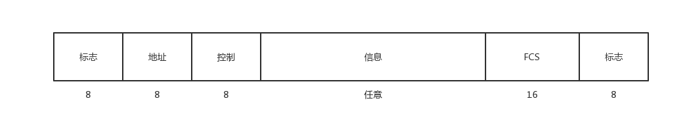
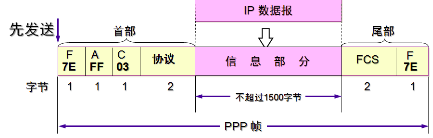
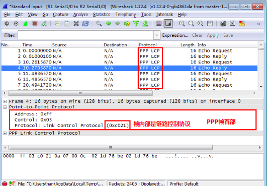
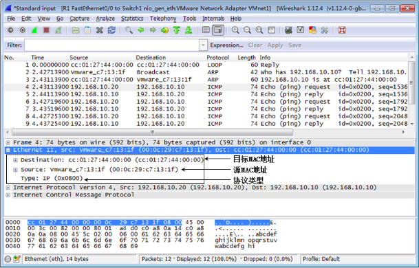

# 数据链路层
## 1.数据链路层要实现3个功能
封装成帧、透明传输、差错检验、数据可靠性、流量控制 

### 1.封装成帧
数据链路层在物理层和网络层之间，而物理层是传输二进制流的，所以数据链路层必须能够将二进制流解析出帧，并将帧转换成二进制流以方便在物理层传输。 
有很多种方法可以用来定界帧。最寻常的方式是设置帧的定界符如： 

帧(例如：HDLC)有开始符(SOH)结束符(EOT)，如果在数据中有开始符和结束符，数据数据链路层就会加入转移字符(ESC) 

**但是定界符的方法在链路是100Mbps时，就不在试用了**，因为它不能告诉物理链路是否断开或者没有数据传输(在这两种情况下链路都没有信号)。

### 2.差错检验
最常用的两种错误检验机制：校验和与循环冗余校验(CRC) 
CRC容易使用硬件实现，且数学证明强壮型高，所以在链路层一般使用CRC。 
在高层协议(如TCP、UDP和IP)中使用校验和。 

#### 1.校验和
校验和非常简单就是对帧内的二进制做二元加法和，将结果保存下来即可(1位)。 

#### 2.循环冗余校验(CRC)
CRC增加了发送数据的长度，在接收端通过做一种除法，如果结果为非0，则数据帧发生了变化。 
已证明CRC可以检查的错误： 
- 单位错误
- 双位错误
- 任何长度小于FCS的突发错误。 

### 3.数据可靠性
当接受到一个错误的数据帧接收机如何回应？
- 1.默默地丢掉不正确的帧
- 2.向发送方返回错误码
- 3.添加纠错码

对于第三种情况纠错码(使用纠错码要添加更多的纠错位)，在一般通信系统中不常用，因为在以太网中数据帧的错误率很低大概``1/10^10``。即是是在无线通信中，也不会添加纠错码。一般在太空通信中，因为重传的成本很高，一般使用纠错码。 

发送机会重新发错误的帧，或者是忽略错误。在后一种情况下高层协议，如TCP，将负责重传。 

### 4.流量控制
在链路层，流量控制用以解决两点接受和发送速率不对等的情况。 
解决该问题的最简单方法是停止等待协议，但它使得链路使用效率很低，所以不过多考虑。 

一种常用的方法是滑动窗口协议： 

## 2.数据链路层协议
对于数据链路层，通过介绍两个协议来了解。 
一个是路由直接通过PPP协议实现传输，还有一个是局域网中的CSMA/CD协议 
### 1.点到点 PPP
PPP协议继承自HDLC(高级数据链路控制)协议，一种老但是使用广泛的协议。 
在HDLC协议中还运行者LCP(链路控制协议)和NCP(网络控制协议)。 

#### 1.HDLC协议
HDLC支持点到点链路和单点到多点链路、半双工和全双工链路。 
HDLC的报文格式如下： 
 
- 标志：帧定界符
- 地址：客户机地址
- 控制：实现帧的多种功能，将帧分成三种(信息帧、监督帧、无序号帧)

**HDLC的一些功能** 
根据控制信息的不同HDLC可在三种不同的模式下工作(HDLC将节点分成服务器和客户端)。 
- 正常响应模式(NRM):客户端只能被动地传输数据以响应服务器的轮询(在多节点网络中，击鼓传花)。在单点到多点的情况下，次站通过主站通信。
- 异步响应模式(ARM):用的不多。客户端可在没有Master的轮询情况下发起数据传输，但是主站任然赋值控制连接
- 异步平衡模式(ABM):通信中的每一方都可充当服务器和客户端，两点具有平等地位(适合点到点通信)

HDLC的流量控制和差错控制使用的是滑动窗口，支持退回N帧或差错重传。 

#### 2.ppp点到点协议
点到点协议广泛用于拨号上网和租用线路访问互联网。为了承载多种协议数据包，PPP包含三个主要组成部分： 
- 1.一种用于封装来自网络层数据包的封装方式
- 2.一种用于处理连接建立、配置和断开的链路控制协议LCP
- 3.一种用于配置不同网络层(上一层)选项的网络控制协议NCP

简要介绍PPP的操作方式： 
当新节点进入网络后，PPP首先要完成登录和配置才能发送数据包。PPP的工作方式如下图：PPP首先要发送LCP数据包来建立和测试连接。连接建立后，发起连接的对等节点在交换网络层数据分组之前可能要对它认证。然后PPP开始发送NCP数据包以便配置用于通信的一个或多个网络层协议。配置完成后，网路层数据分组在连接终止之前通过链路发送。 
 
状态变迁： 
- Dead to Establish: 在对等方开始使用链路时，通过载波检测或人为配置激活这个状态迁移
- Establish to Authenticate：LCP通过对等之间交换配置数据包来建立连接。所有不需要协商的选项，直接配置为它们的默认值。只有独立于网络层的选项才需要进行协商，网络层协议的配置选项留给NCP来完成。
- Network to Terminate：很多情况都会发生

PPP协议的报文格式如下： 
 
- 1.address字段通常都为1(对应于HDLC协议的所有地址)
- 2.Control字段通常也为固定值
- 3.Protocol通常也为固定值(表示上层协议是IP)

使用wireshark抓包时，定界符7E是看不到的在网卡处
被过滤，同样被过滤的还有FCS。 

## 4.2广播信道的数据链路层
对于以太网的概念，有些是这样定义的：使用CSMA/CD带冲突检测的载波侦听多路访问技术通信是以太网(每个地址都有mac地址。) 
**我们要分清局域网和以太网的区别**
局域网是按地域大小划分的，比如一个家就可以使一个局域网。 

但是我们想一个问题，如果一个局域网的所有终端连接的都是交换机，根本没有用到集线器(意思是说，局域网中的计算机发出的非广播数据包，是不会传送到非目标主机上(被交换机阻塞))，那么就没有用到CSMA/CD协议，对于这种网络我们有时也习惯称为以太网。 

__2.冲突解决方法：退避算法__ 
为了实现退避算法，以太网中有最短帧 512b也就是64个字节 
512b可以满足最大传输距离是5000m，而局域网实际不会达到这么远，所以512b足够 
__3.以太网帧没有结束字符编码因为使用的是曼彻斯特编码__ 

__网卡的作用__ 
1.串行数据和并行数据转换 
2.数据链路层的功能，封装成帧，帧的差错检验和CSMA/CD 

__优化以太网__ 

网桥，减小冲突域，但增加了延迟(不多见了，一般直接用交换机，交换机直接接电脑) 

__以太网的帧格式__ 
 
 

# 数据链路层的上端ARP
ARP协议是为了将IP地址转换为MAC地址。在一个CSMA/CD以太网中通信要使用MAC地址，所以需要使用ARP协议找到目标主机的MAC地址。 
