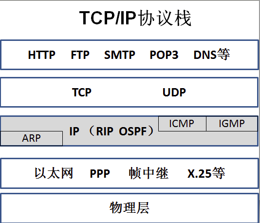
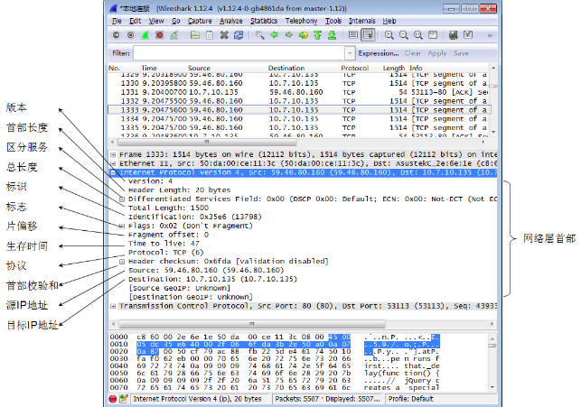
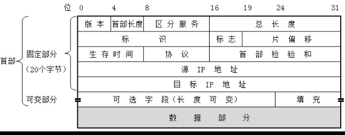
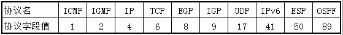

# 网络层协议
**网络层要解决的问题有三个** 
- 1.如何通过链路层技术将网络连接起来
- 2.如何在全球范围内唯一确定一台主机
- 3.如何在两台主机之间找到一条路径并能沿路径转发分组

## 网络层首部
  

 

- 1)版本version 占4位，指IP协议的版本(4版本或下一代6版本)
- 2)首部长度Herder Length 占4位 该字段以4个字节为单位指定头部长度。最常见的头部长度是5个单位，也就是20字节。 
- 3)区分服务Differentiated Services Field 占8位
    计算机给特定应用程序添加一个标志，被配置的路由器优先转发
    加标记的数据包。
- 4)总长度Total Length 占16位
    总长度指IP首部和数据之和的长度，也就是数据包的长度，单位是字节
    总大小是2^16-1=65535字节。
- 5)标识identification 占16位
    相当于一个计数器，每当给客户端发送一个数据包计数器就增加1。
    当数据包要分片时，这些片的标识都是一致的。
- 6)标志flag 占3位 目前只有前两位(最低两位)有意义
    标志位最低位记为MF(More Fragment)。MF=1表示后面还有分片 MF=0
    表示后面没有分片。
    DF(Don't Fragment) 意思是不能分片，当DF=0时才可以分片
- 7)偏移量Fragment offset 占13个字节
    只有数据包分片时才有意义 单位8个字节
- 8)生存时间TTL
- 9)协议Protocol 占8字节
- 10)首部检验和Herder checksum 占16为

 

## ICMP报文
