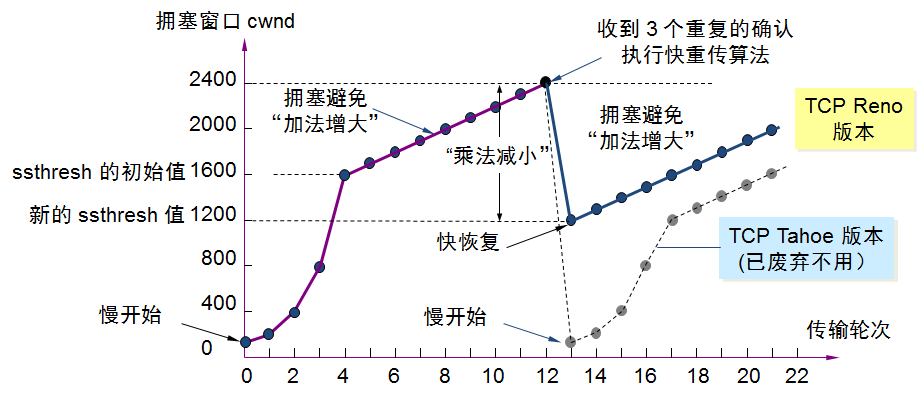
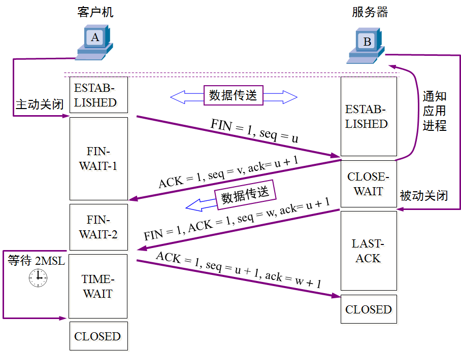

# 传输层应用场景
TCP 要传输的内容分成多个数据包 编号 流量控制 拥塞避免 可靠传输
    客户端和服务端需要建立连接 通讯结束释放连接 
UDP 要传输的内容一个数据包就能全部发送 传输成功与否由应用层来判断 

## 传输层协议和应用层协议之间的关系

- HTTP TCP+80
- FTP  TCP+21
- SMTP TCP+25
- POP3 TCP+110
- RDP  TCP+3389
- DNS  UDP+53
- MYSQL TCP+3306
- MSSQL TCP+1433
- telnet TCP+23
- Windows访问共享文件夹 TCP+445

## 端口和网络安全
防火墙只拦截进来的流量，出去的流量不拦截，同时出去的流量还可以回来 

## UDP
__1)UDP是无连接的__ 
__2)UDP不合并也不拆分数据包__ 
__3)首部只有8个字节__ 

## TCP
 
 

- 序号Swqence number 占4字节 TCP是面向字节流的
    序号数就是这个TCP包中数据部分占原数据流的第几字节
- 确认号Acknowledge number TCP是面向字节流的 又是可靠传输
    确认号N 表示N-1字节以及收到，请求发送N以及后面的字节
- Urgent 为1时 优先传
- Acknowledge 为1时 确认号有效
- Push 为1时 客户端立即读取
- Reset 为1时 客户端服务的TCP连接出现严重错误，需断开重连
- Syn 只有请求建立链接和确认链接 数据包为1
- Fin 为1 表示需断开链接

- 窗口Window size value 剩余缓存
- 紧急指针Urgent pointer 占两字节 指数据部分紧急指令的部分

## TCP可靠传输
1.停止等待协议 
发送数据包，超时未收到回复 重传 
2.连续ARQ协议和滑动窗口协议 
连续发一组数据包，等待确认，不会立即发送未确认的数据包
超时重发 
3.一组数据包出现个别丢包 确认数据包会有选择数据包
最多可以指明4个字节块 

__TCP超时重传__ 
在建立链接时可以计算数据包往返时间 
在发送确认数据包时也可以计算往返时间 

## TCP流量控制
窗口大小来控制流量 

## TCP拥塞控制
 
现实中未达到链路最大时，就可能发生拥塞  

 

__现在正在应用的拥塞控制__ 

快重传 快恢复 

 
## TCP连接管理
三次握手
TCP连接请求 SYN=1 ACK=0 
TCP连接确认 SYN=1 ACK=0 
确认的确认 传输数据的TCP数据包 SYN=0 

__TCP连接释放__ 
 
